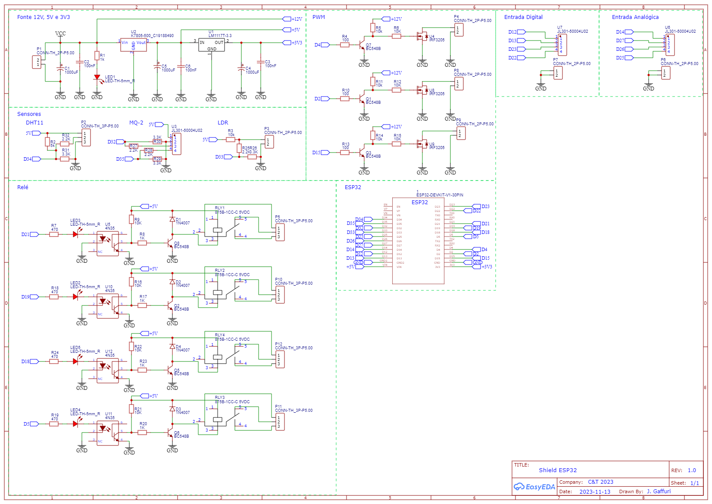
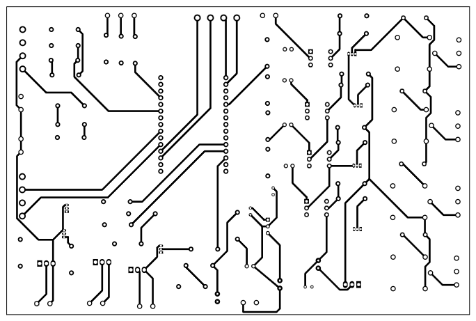
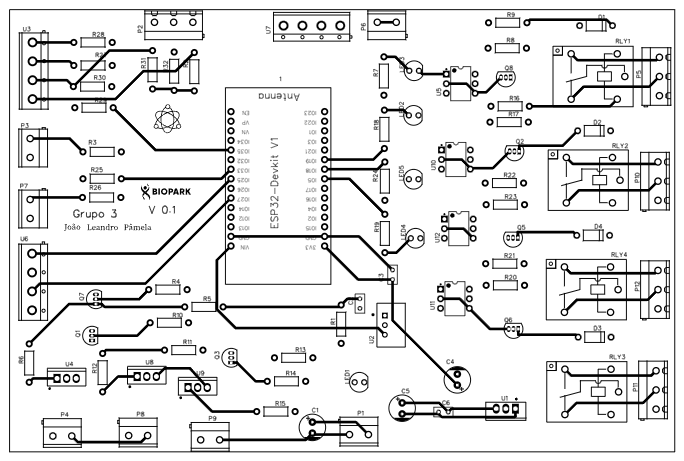
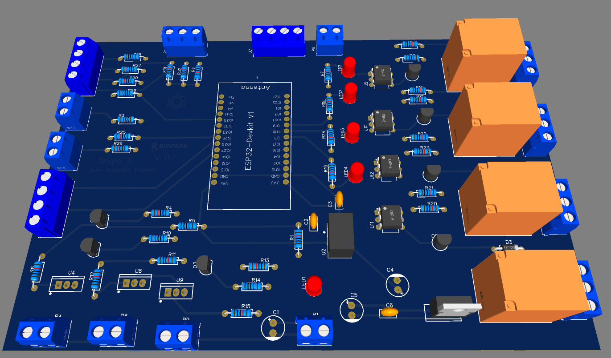

# Open Hardware - Shield ESP32
ESP32 Open Hardware Shield é um projeto de hardware livre que desenvolve um shield multifuncional para o microcontrolador ESP32. Ele integra sensores de gás, luminosidade, umidade e temperatura, além de controle de LEDs e relés. Código e designs estão disponíveis para contribuição e personalização.

## Schema

## PCB Bottom Layer

## PCB Top Layer

## Visão 3D PCB

## Materiais
| Material  | Designator | Quantidade |
| ---- | ---- | ---- |
| ESP32 | 1 | 1  |
| Capacitor 1000uF | C1,C4,C5 | 3  |
| Capacitor 100nF | C2,C3,C6 | 3  |
| Diodo | D1,D2,D3,D4 | 4  |
| LED | LED1,LED2,LED3,LED4,LED5 | 5  |
| Conector 2 pinos | P1,P3,P4,P6,P7,P8,P9 | 7  |
| Conector 3 pinos | P2,P5,P10,P11,P12 | 5  |
| Conector 4 pinos | U3,U6,U7 | 3  |
| Transistor | Q1,Q2,Q3,Q5,Q6,Q7,Q8 | 7  |
| Resistor 100 | R4,R10,R13 | 3  |
| Resistor 470 | R7,R18,R19,R24 | 4  |
| Resistor 1k | R1,R8,R17,R20,R23| 5  |
| Resistor 2.2k | R25,R27,R28,R32 | 4  |
| Resistor 3.3k | R26,R29,R30,R31 | 4  |
| Resistor 5k | R2 | 1  |
| Resistor 10k | R3,R5,R11,R14 | 4  |
| Relé 5Vdc 20A | RLY1,RLY2,RLY3,RLY4 | 4  |
| Regulador de Tensão 3 pinos 3.3V | U1 | 1  |
| Regulador de Tensão DC-DC | U2 | 1  |
| Transistor MOSFET | U4,U8,U9 | 3  |
| Optoacoplador | U5,U10,U11,U12 | 4  |